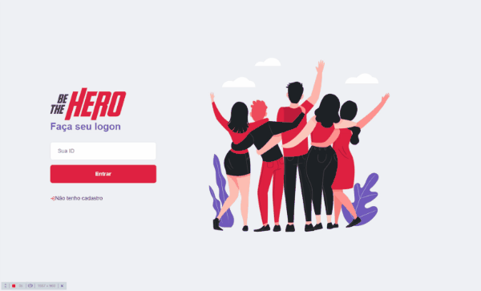
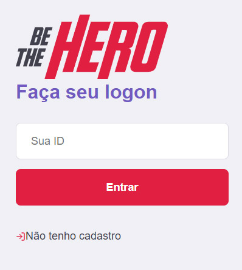

<p align="center">
   
</p>

# Be The Hero

This project is part of the [Semana OmniStack](https://rocketseat.com.br/) course and consists on a website that and ONG can creat an account and post what its need by creating "cases"  with description and values.

So, other users can look for cases that they can help!

We mainly use [React](https://reactjs.org), [React Native](https://reactnative.dev/) and [SQLite](https://www.sqlite.org). 

<br />
<p align="center">
    
</p>

---

# Guide

* [Features](#features)
* [Installation](#installation)
* [Using](#using)
* [Technologies](#technologies)
* [Future Implementations](#future-implementations)


# Features

*  Users can rate the restaurant and receive a coupon for it.
*  Administrators could use an Google Sheet to record the data.
*  Administrators could do some Promotions and change it texts.


# Installation

**You will need install:**

 [Node.js](https://nodejs.org/en/download/) <br />
 [Npm](https://www.npmjs.com/) 

**Cloning repository**

```git clone https://github.com/cledman/be-the-hero.git```

**Install dependencies for Backend, on backend folder**

```npm install```

**Install dependencies for Frontend on frontend folder**

```npm install```

**Install dependencies for Mobile on mobile folder**

```npm install```

**Enviroment variables**

There´s an example from the enviroment variables available at ```.env.example```


**Go to the Backend folder and:**

```npm start```

**Go to the Frontend folder and:**

```npm start```

**Go to the Mobile folder and:**

ATENTION: Before run "npm" make sure the "base url" from api.js (from mobile folder) is set on same port as the backend on.

```npm start```

**Now we have to create the database**

npx knex migrate:make create_ongs
npx knex migrate:make create_incidents

# Using

After you start the Backend and after that, the Frontend or Mobile, you will need an account int order to use the website.
You can create one by clicking on "Não tenho cadasto" button:

<p align="center">
   
</p>
------------------------------------
-----------------------------
**Run the application in a development environment:**

```npm run dev```

# Technologies

* [NodeJS](https://nodejs.org/en/) to handle the server, 
* [React](https://reactjs.org) and [React Native](https://reactnative.dev/) to handle the rendering
* [ExpressJS](https://expressjs.com/), 
* [KnexJS](http://knexjs.org/) to handle data
* [SQLite](https://www.sqlite.org) to record data

# Future Implementations

We could create and database for the volunteers and notify them when they could help.

Thanks to [Diego Fernantes](https://github.com/diego3g) from [RocketSeat](https://rocketseat.com.br/).
##

